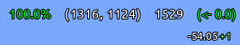

# Waywall Setups Archive

[Versão em Português](README.md)

A collection of the Waywall setups I have used over time.

This repository was created to organize my old configurations. Before that, I used to keep multiple copies of my Waywall folders whenever I made significant changes, which eventually resulted in several backups scattered around with no clear record of what had changed between them.

By turning those configurations into a Git repository, I can keep each setup documented separately while preserving both the original configurations and the customizations I developed over time.

The purpose of this project is not to provide my current Waywall configuration, but rather to serve as a historical archive of the different setups I have used throughout my Linux MCSR experience.

---

## Setup History

### arjuncgore

Based on:

* https://github.com/arjuncgore/waywall_generic_config

This was one of the setups I used for the longest period of time.

In addition to visual tweaks and personal adjustments, I implemented a customized Ninjabrain Bot overlay based on:

* https://github.com/arjuncgore/waywall_ninbot_overlay

My version changes the way information is displayed on screen, reorganizing the layout and prioritizing only the data I find most useful during runs.

---

### arjuncgore-1366x768

A variation of the previous setup adapted for 1366x768 displays.

* https://github.com/gustavogordoni/waywall-setups

This configuration was used while playing on a lower-resolution monitor and required several adjustments to overlay positioning and interface elements.

---

### NotE4sy

Based on:

* https://github.com/NotE4sy/fray-s-waywall-config

One of the first Waywall configurations I experimented with.

Despite its simplicity, it served as a great introduction to how Waywall works. Its relatively small and easy-to-understand structure helped me learn how different configurations were organized and what aspects could be customized.

I only used this setup for a short period, mainly for experimentation and learning purposes.

---

### ethan-davies

Based on:

* https://github.com/ethan-davies/waywall-config

Although this configuration is itself derived from Soup's setup, it was the first more advanced configuration that I successfully adapted to my own environment.

For reasons I no longer remember, I found it much easier to get working than Soup's original configuration at the time.

It served as a bridge between the simpler setups I started with and the more complex configurations I use today.

---

### soup12h

Based on:

* https://github.com/soup12h/waywall-config

This is the configuration I currently use.

Although I had known about this setup for quite some time, I initially struggled to get it working properly.

After spending time with Ethan Davies' version and becoming more familiar with its structure, I was eventually able to adapt Soup's original configuration to fit my own needs.

I am currently developing an integration with:

* https://github.com/qMaxXen/NBTrackr

The goal is to replace my previous custom Ninjabrain Bot overlay with a solution based on NBTrackr.

Instead of manually drawing interface elements, Waywall displays the image generated by NBTrackr directly, allowing me to take advantage of the project's features and customization options.

This approach makes it possible to display the exact image produced by NBTrackr inside Waywall while keeping it synchronized with Ninjabrain Bot's data.

---

## Screenshots and Preview

For a complete visual overview of all setups and modes:

[PREVIEW.en.md](PREVIEW.en.md)

### Highlights

#### ethan-davies — Custom Ninjabrain Bot Overlay

#### soup12h — NBTrackr Integration

---

## Other Projects Used (Directly or Indirectly)

### Waywall

https://github.com/tesselslate/waywall

### Ninjabrain Bot

https://github.com/Ninjabrain1/Ninjabrain-Bot

### NBTrackr

https://github.com/qMaxXen/NBTrackr

### waywall_ninbot_overlay

https://github.com/arjuncgore/waywall_ninbot_overlay

### Waywork

https://github.com/Esensats/waywork

### plug.waywall

https://github.com/its-saanvi/plug.waywall

---

## Notes

This repository primarily exists for documentation and archival purposes.

The configurations stored here represent different stages of my experience with Waywall and Linux MCSR. As such, they may contain personal modifications, experiments, incomplete integrations, or features that do not necessarily reflect my current setup.
